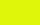
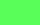

# Commodore 64 Colors

The Commodore 64 has a palette of 16 colors. This post tabulates the various ways on how to use the colors with the keyboard or in code.

There are a number of ways to change the colors. This table shows keyboard shortcuts, the `CHR$` codes, and the `POKE` values. The colors shown are the default palette colors used in the Vice emulator.

| Name     | Color                                      | C= Key | Vice   | CHR$ | POKE |
|:---------|:-------------------------------------------|:------:|:------:|-----:|-----:|
| Black    |      | Ctrl-1 | Tab-1  | 144  | 0    |
| White    |      | Ctrl-2 | Tab-2  | 5    | 1    |
| Red      |        | Ctrl-3 | Tab-3  | 28   | 2    |
| Cyan     |       | Ctrl-4 | Tab-4  | 159  | 3    |
| Purple   |     | Ctrl-5 | Tab-5  | 156  | 4    |
| Green    |      | Ctrl-6 | Tab-6  | 30   | 5    |
| Blue     |       | Ctrl-7 | Tab-7  | 31   | 6    |
| Yellow   |     | Ctrl-8 | Tab-8  | 158  | 7    |
| Orange   |     | C= 1   | Ctrl-1 | 129  | 8    |
| Brown    |      | C= 2   | Ctrl-2 | 149  | 9    |
| Lt.Red   |    | C= 3   | Ctrl-3 | 150  | 10   |
| Dk.Grey  |   | C= 4   | Ctrl-4 | 151  | 11   |
| Grey     |      | C= 5   | Ctrl-5 | 152  | 12   |
| Lt.Blue  |   | C= 6   | Ctrl-6 | 153  | 13   |
| Lt.Green |  | C= 7   | Ctrl-7 | 154  | 14   |
| Lt.Grey  |   | C= 8   | Ctrl-8 | 155  | 15   |
